# epicbook-azure-deployment
EpicBook bookstore web app deployed on Azure VM with MySQL Flexible Server - Assignment 25
# EpicBook Azure Deployment — Assignment 25

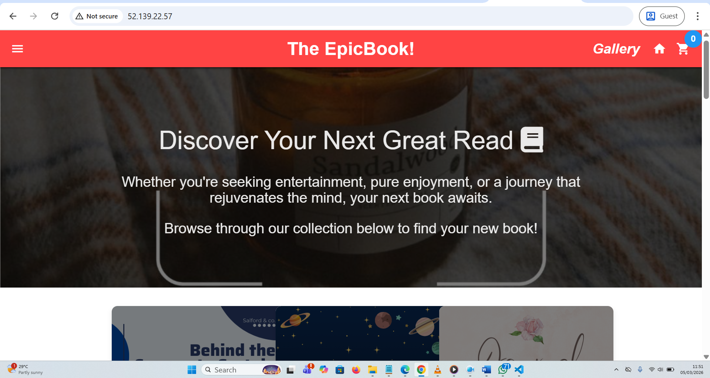

## Project Overview

This project deploys the **EpicBook** online bookstore web application on Microsoft Azure using a Virtual Machine and Azure Database for MySQL Flexible Server. The deployment covers full cloud infrastructure setup including networking, security groups, VM provisioning, database configuration, and application hosting.

**Live Application:** http://52.139.22.57  
**Region:** Canada Central  
**Database Server:** epicbook-mysql2  

---

## Architecture
```
Internet
    |
    | (Port 80 HTTP)
    |
[NSG-Public: Allow HTTP 80, SSH 22]
    |
[EpicBook-VM — Ubuntu 22.04 LTS — 52.139.22.57]
    |         \
    |          Nginx (Port 80) --> Node.js/Express (Port 8080)
    |                                      |
    |                              PM2 Process Manager
    |
[EpicBook-VNet 10.0.0.0/16]
    |
    |--- public-subnet (10.0.1.0/24)  --> VM
    |--- private-subnet (10.0.2.0/24) --> MySQL (documented)
    |
[epicbook-mysql2 — Azure MySQL Flexible Server]
    |
[NSG-Private: Allow MySQL 3306 from 10.0.1.0/24 only]
```

---

## Technologies Used

| Technology | Purpose |
|---|---|
| Microsoft Azure | Cloud platform |
| Azure Virtual Machine (Ubuntu 22.04 LTS) | Application server |
| Azure MySQL Flexible Server | Managed database |
| Azure Virtual Network + Subnets | Network isolation |
| Network Security Groups (NSGs) | Firewall rules |
| Node.js + Express.js | Backend application |
| Nginx | Reverse proxy (port 80 → 8080) |
| PM2 | Node.js process manager |
| Git | Version control |
| mysql-client | Database management |

---

## Installation & Deployment Guide

### Prerequisites
- Azure subscription
- SSH client (Terminal / WSL / PuTTY)
- GitHub account

---

### Step 1 — Create Network Infrastructure

**Resource Group**
1. Azure Portal → Resource Groups → + Create
2. Name: `EpicBook-RG` | Region: `Canada Central`

**Virtual Network**
1. Search Virtual Networks → + Create
2. Name: `EpicBook-VNet` | Address space: `10.0.0.0/16`
3. Add subnet: `public-subnet` → `10.0.1.0/24`
4. Add subnet: `private-subnet` → `10.0.2.0/24`

**NSG-Public** (attach to public-subnet)
- Allow SSH: Port 22, Any source
- Allow HTTP: Port 80, Any source

**NSG-Private** (document only — do NOT attach to MySQL delegated subnet)
- Allow MySQL: Port 3306, Source 10.0.1.0/24

**Public IP**
- Name: `EpicBook-PublicIP` | SKU: Standard | Assignment: Static

---

### Step 2 — Provision the Virtual Machine

1. Create VM: Ubuntu 22.04 LTS, Standard B1s
2. Network: EpicBook-VNet → public-subnet
3. SSH key authentication → download .pem file
4. Add port 80 to the VM's auto-created NSG (EpicBook-VM-nsg)

**Connect via SSH:**
```bash
chmod 400 ~/Downloads/EpicBook-VM_key.pem
ssh -i ~/Downloads/EpicBook-VM_key.pem azureuser@52.139.22.57
```

**Install required software:**
```bash
sudo apt update && sudo apt upgrade -y
sudo apt install nodejs npm nginx git mysql-client -y
```

---

### Step 3 — Fix Azure DNS Resolution

Ubuntu 22.04 uses systemd-resolved (127.0.0.53) by default which does not forward to Azure's internal DNS. Fix this first:
```bash
sudo rm /etc/resolv.conf
sudo tee /etc/resolv.conf << 'EOF'
nameserver 168.63.129.16
EOF
```

---

### Step 4 — Deploy the Application
```bash
git clone https://github.com/pravinmishraaws/theepicbook.git
cd theepicbook
npm install
```

**Configure Nginx reverse proxy:**
```bash
sudo nano /etc/nginx/conf.d/theepicbooks.conf
```

Paste this content:
```nginx
server {
    listen 80;
    server_name 52.139.22.57;

    location / {
        proxy_pass http://localhost:8080;
        proxy_http_version 1.1;
        proxy_set_header Upgrade $http_upgrade;
        proxy_set_header Connection 'upgrade';
        proxy_set_header Host $host;
        proxy_cache_bypass $http_upgrade;
    }
}
```
```bash
sudo nginx -t && sudo systemctl restart nginx
```

---

### Step 5 — Create Azure MySQL Flexible Server

1. Search: Azure Database for MySQL flexible servers → + Create → Advanced create
2. Server name: `epicbook-mysql2` | Region: `Canada Central`
3. MySQL version: 8.0 | Compute: Burstable B1ms
4. Admin username: `epicbookadmin`
5. Networking: **Public access** → add VM IP (52.139.22.57) to firewall rules
6. Check: Allow public access from any Azure service

**Update Sequelize config** (this is the file the app actually reads):
```bash
cat > ~/theepicbook/config/config.json << 'EOF'
{
  "development": {
    "username": "epicbookadmin",
    "password": "YourPassword",
    "database": "bookstore",
    "host": "epicbook-mysql2.mysql.database.azure.com",
    "port": 3306,
    "dialect": "mysql",
    "dialectOptions": {
      "ssl": { "rejectUnauthorized": false }
    }
  },
  "test": {
    "username": "epicbookadmin",
    "password": "YourPassword",
    "database": "bookstore",
    "host": "epicbook-mysql2.mysql.database.azure.com",
    "port": 3306,
    "dialect": "mysql",
    "dialectOptions": {
      "ssl": { "rejectUnauthorized": false }
    }
  },
  "production": {
    "username": "epicbookadmin",
    "password": "YourPassword",
    "database": "bookstore",
    "host": "epicbook-mysql2.mysql.database.azure.com",
    "port": 3306,
    "dialect": "mysql",
    "dialectOptions": {
      "ssl": { "rejectUnauthorized": false }
    }
  }
}
EOF
```

---

### Step 6 — Create Database and Import Data
```bash
mysql -h epicbook-mysql2.mysql.database.azure.com -u epicbookadmin -p
```

Inside MySQL:
```sql
CREATE DATABASE bookstore;
SHOW DATABASES;
exit
```

Import schema and seed data:
```bash
cd ~/theepicbook
mysql -h epicbook-mysql2.mysql.database.azure.com -u epicbookadmin -p bookstore < db/BuyTheBook_Schema.sql
mysql -h epicbook-mysql2.mysql.database.azure.com -u epicbookadmin -p bookstore < db/author_seed.sql
mysql -h epicbook-mysql2.mysql.database.azure.com -u epicbookadmin -p bookstore < db/books_seed.sql
```

---

### Step 7 — Start Application with PM2
```bash
npm install -g pm2
pm2 start server.js --name epicbook
pm2 startup && pm2 save
pm2 status
```

---

## Screenshots

### Task 1 — Network Infrastructure

**Resource Group**
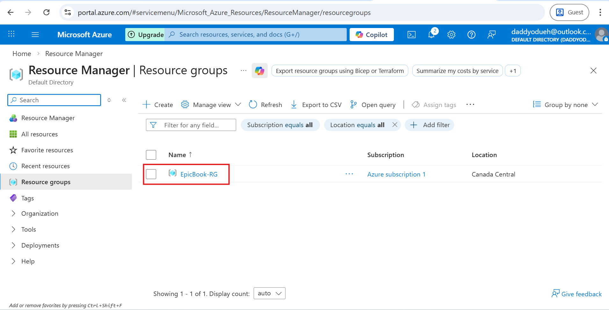

**Virtual Network**
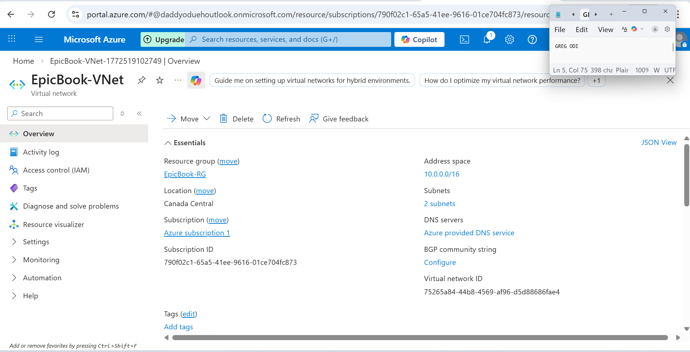

**NSG-Public Rules**
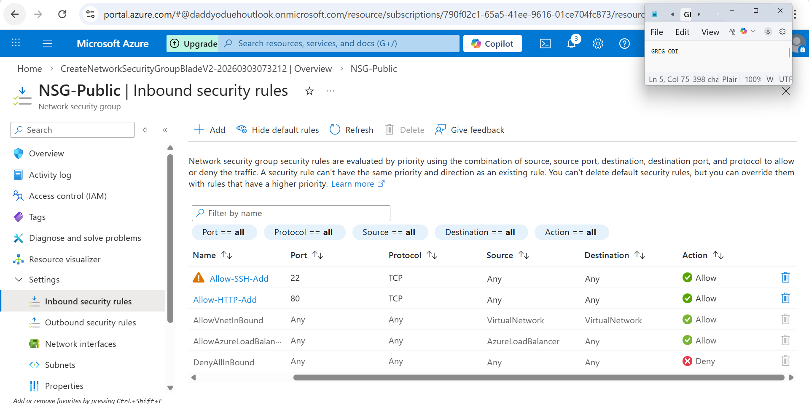

**NSG-Private Rules**
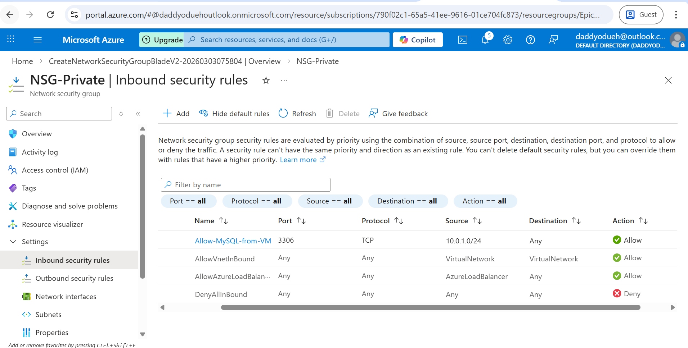

**Public IP**
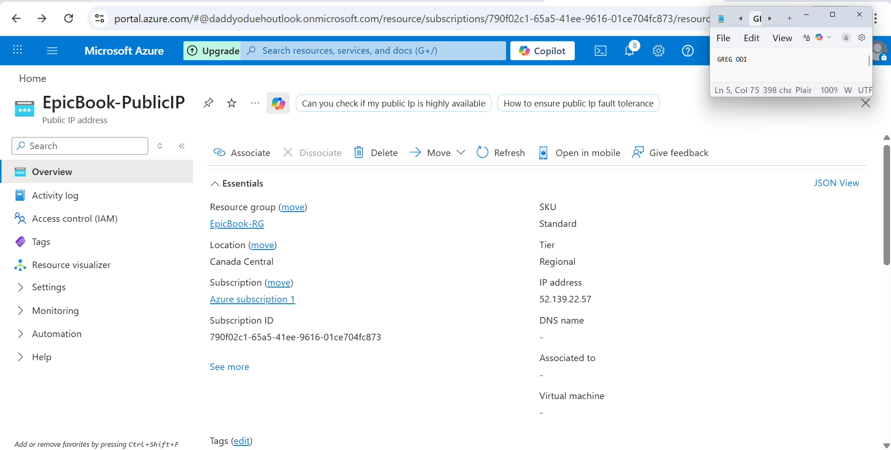

---

### Task 2 — Virtual Machine

**VM Overview**
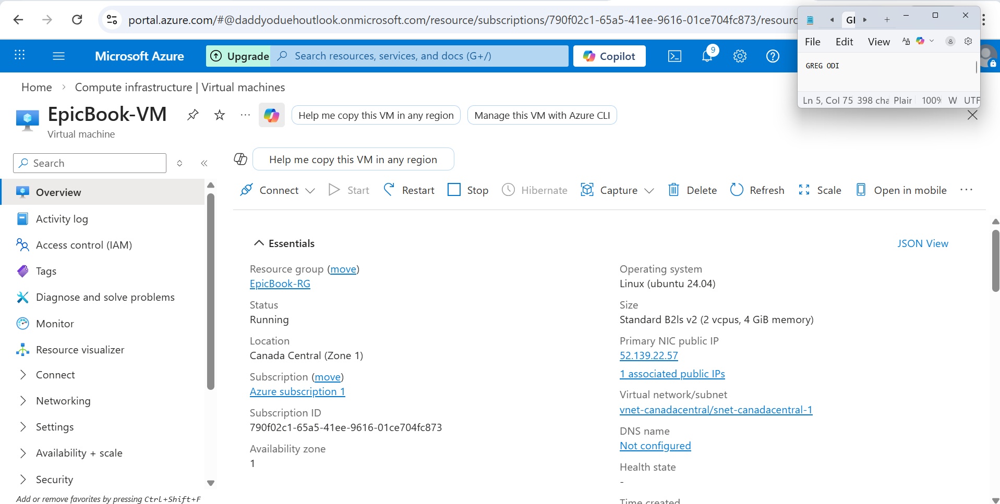

**SSH Connected**
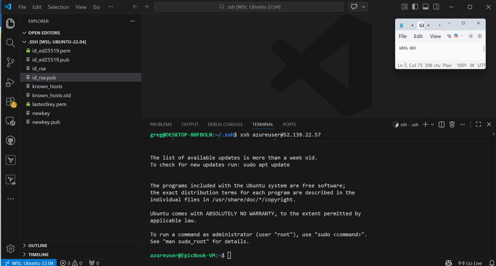

**Software Installed**
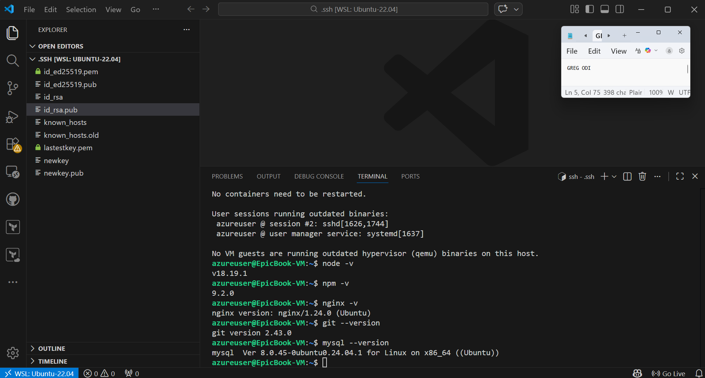

---

### Task 3 — Application Deployment

**Git Clone**
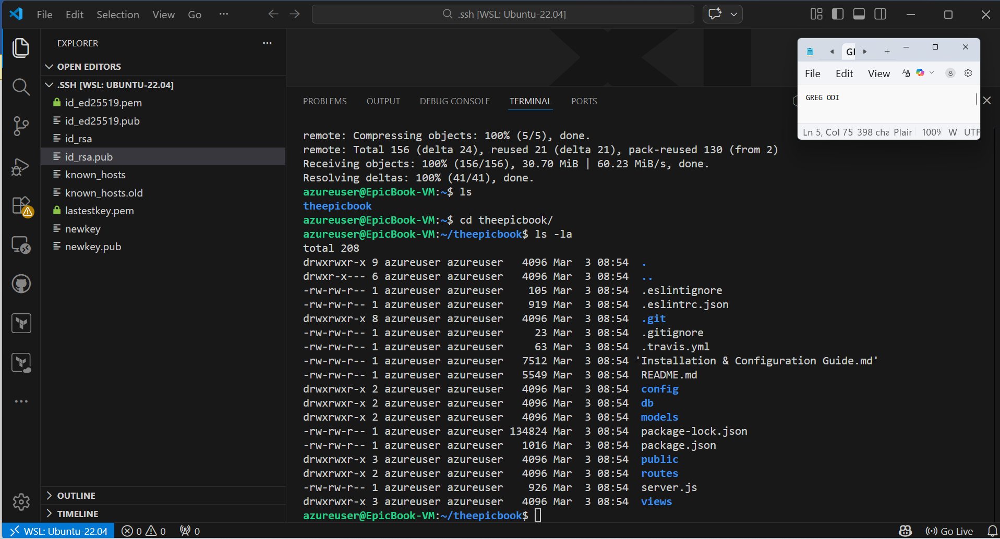

**NPM Install**
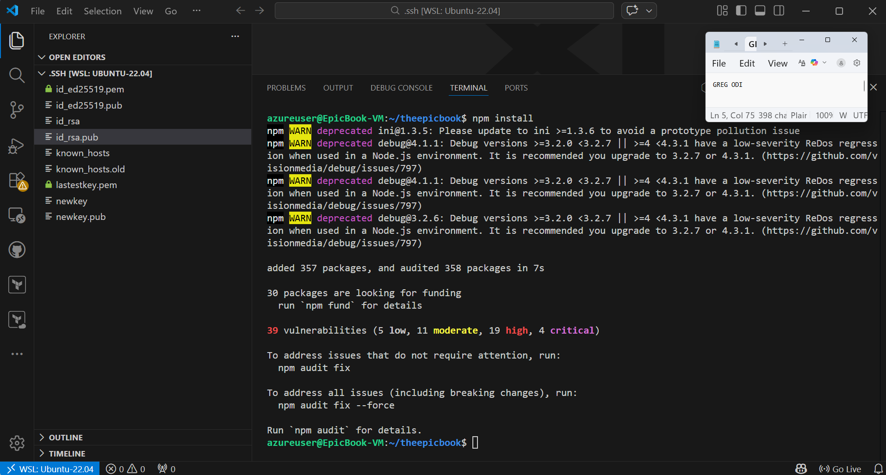

**Nginx Config**
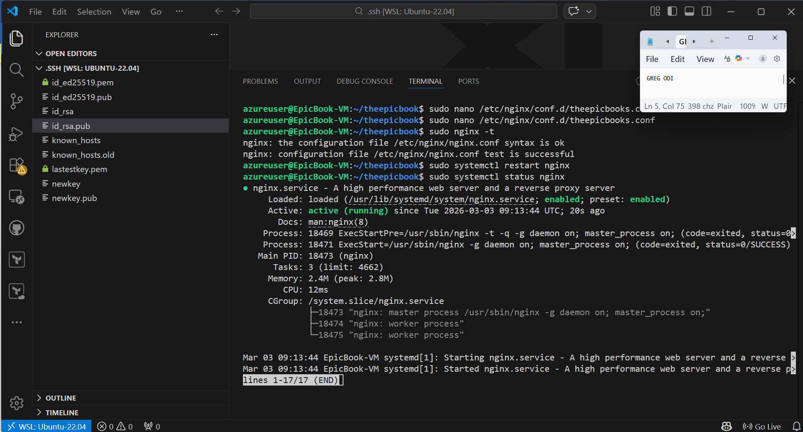


---

### Task 4 — MySQL Database

**MySQL Server Overview**
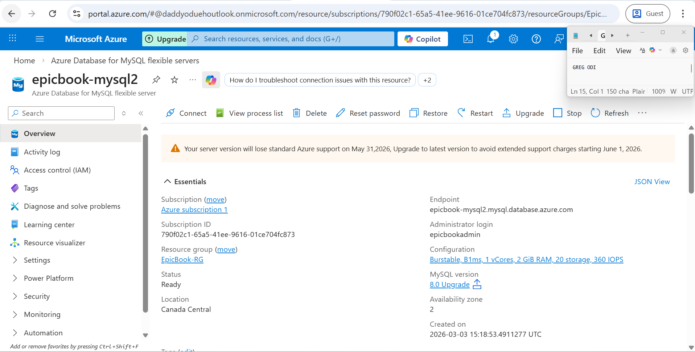

**Schema Import**
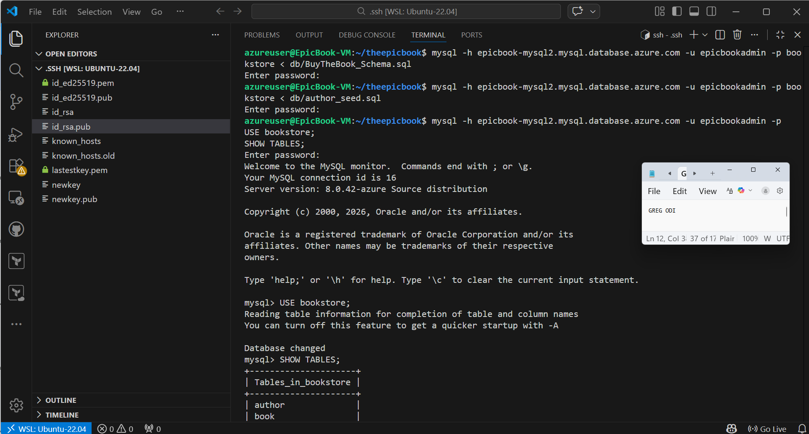

**Database Tables**
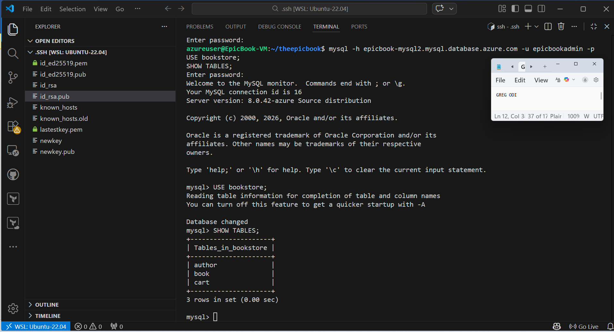

---

### Task 5 — End-to-End Testing

**App Homepage**


**Product Listing**
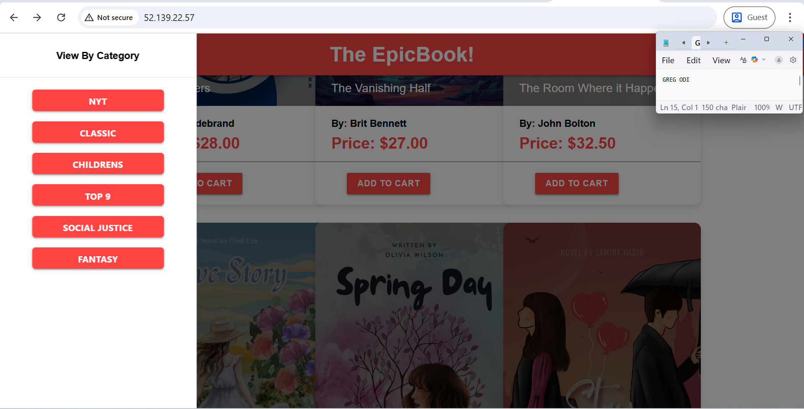

**Add to Cart**
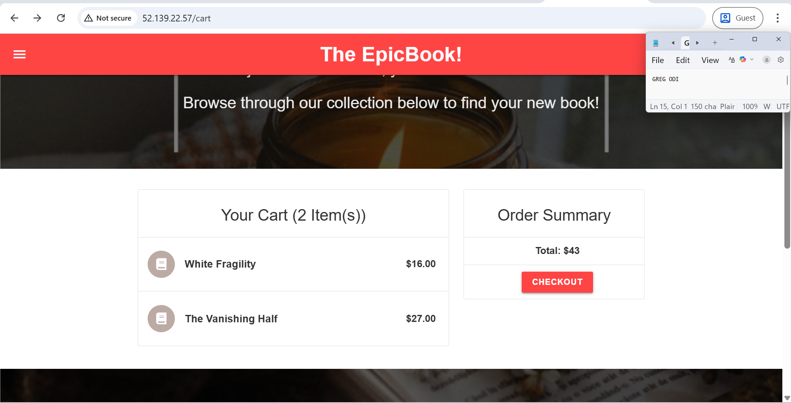

**Order Placed**
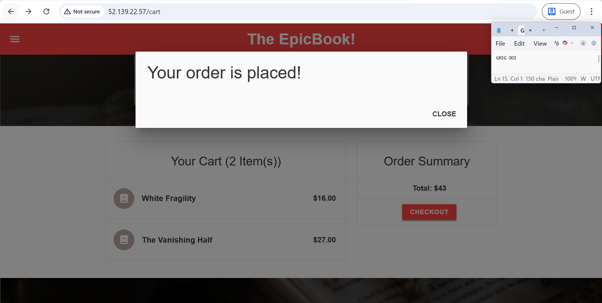

---

### Task 6 — LinkedIn Post

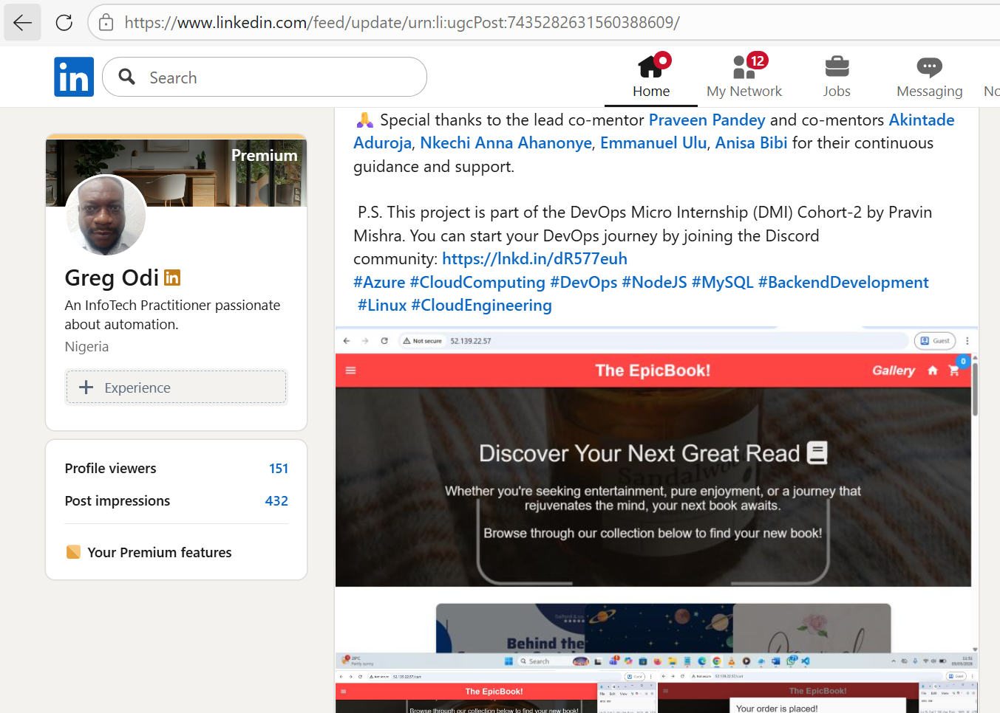

---

## Troubleshooting

| Problem | Cause | Solution |
|---|---|---|
| NXDOMAIN on MySQL hostname | Ubuntu uses 127.0.0.53 not Azure DNS | Set nameserver 168.63.129.16 in /etc/resolv.conf |
| ECONNREFUSED 127.0.0.1:3306 | App reads config/config.json not root config.json | Update ~/theepicbook/config/config.json |
| SSL connection refused | Azure MySQL enforces require_secure_transport=ON | Add dialectOptions.ssl to Sequelize config |
| Access denied password error | Special character $ in password causing JSON issues | Use alphanumeric password only |
| 502 Bad Gateway | Node.js not running on port 8080 | Fix DB config and pm2 restart epicbook |
| Port 80 not responding | VM auto-NSG missing port 80 rule | Add HTTP rule to EpicBook-VM-nsg |
| Connection timeout to MySQL | NSG attached to delegated MySQL subnet | Remove NSG from delegated subnet |

---

## LinkedIn Post

https://www.linkedin.com/posts/gregodi_azure-cloudcomputing-devops-activity-7435282633154187264-nwPn?utm_source=share&utm_medium=member_desktop&rcm=ACoAAE5EKpEBPgpai0QaYwYtYw7WEaN8rrsFRF4

---

*Assignment 25 — EpicBook Azure Deployment*

